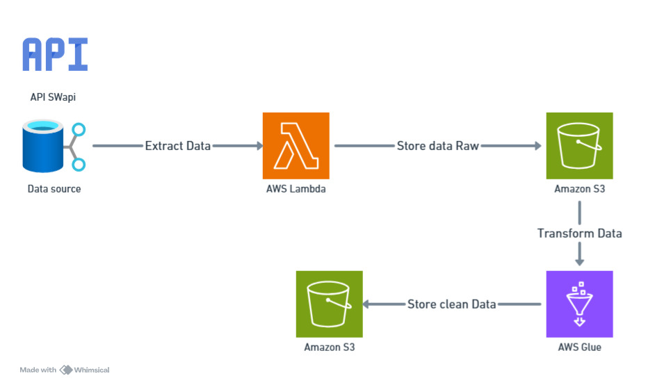

From: Baz Foobar <baz@artefact.com>  
To: Alice Smith <alice@artefact.com>  
Subject: Re: [Request] Data Ingestion with AWS  

Hi Alice,

Thanks for the detailed request! Here's how I propose to build the pipeline:

✅ A Lambda function will fetch the data from the Galactic Services API (`https://swapi.info/people`) and save the raw JSON with timestamp into the `raw/` folder of an S3 bucket.

✅ A Glue Studio Job will be triggered manually or via schedule, which:
- Extracts relevant fields
- Normalizes birth years
- Converts mass to pounds
- Applies filters and data cleaning rules
- Outputs a clean CSV to the `processed/` folder

 All the code is included in the `src/` folder in this repository. A diagram and implementation notes can be found in `README.md`.

 For automation, I recommend using EventBridge rules or Step Functions to orchestrate the Lambda → Glue execution daily.

 Bonus: I’ve included a Terraform file (in `src/iac/`) that can deploy or destroy this pipeline in your AWS environment.

Let me know if anything needs adjusting or if you'd like a demo!

Cheers,  
Baz

## Pipeline Automation

To run the process automatically every hour:

### 1. Set Up an EventBridge Rule

- Create a new rule in **Amazon EventBridge**
- **Type**: `Schedule`
- **Pattern**: `rate(1 hour)` or cron expression:  

0 * * * ? *

markdown
Copiar
Editar
- **Target**: Select your Lambda function

### 2. Automated Sequence

- EventBridge triggers the Lambda every hour  
- Lambda downloads data and saves it to S3 (`raw/` folder)  
- Lambda can optionally invoke the Glue Job  
- Glue Job processes the data and saves it to S3 (`processed/` folder)

---

### Optional: Use Step Functions to Orchestrate the Entire Flow

1. Lambda for data extraction  
2. Glue Job for data transformation  
3. Notification step on completion


## 📁 Terraform Infrastructure Overview

This project uses Terraform to define and deploy the AWS infrastructure required for the data ingestion pipeline. Below is a breakdown of each file in the Terraform configuration:

---

### `main.tf`

This is the core of the infrastructure definition. It includes:

- The **AWS provider** configuration (`region`).
- Creation of an **S3 bucket** with two folders: `raw/` and `processed/` to organize incoming and transformed data.
- A **Lambda execution IAM role** with the necessary trust relationship.
- Attachment of **IAM policies** to allow:
  - Writing to S3 (`AmazonS3FullAccess`)
  - Writing logs to CloudWatch (`AWSLambdaBasicExecutionRole`)
- A **Lambda function** that:
  - Uses Python 3.9
  - Is zipped from the `lambda/ingest_people.py` file
  - Has access to the S3 bucket via environment variables

---

### `variables.tf`

This file contains all configurable parameters for the deployment:

- `region`: The AWS region to deploy to.
- `bucket_name`: Name of the S3 bucket.
- `lambda_function_name`: Name of the Lambda function.

These variables allow for flexibility across environments (e.g., dev, staging, production).

---

### `outputs.tf`

Defines outputs that are shown after running `terraform apply`. These include:

- The created S3 bucket name.
- The Lambda function name.
- A sample command to invoke the Lambda manually using the AWS CLI.

---

### `lambda/ingest_people.py`

This is the source code for the Lambda function, written in Python. It is automatically zipped and uploaded by Terraform using the `archive_file` data source. The handler must match the entry point defined in `main.tf` (`handler = "ingest_people.lambda_handler"`).

---

### How to Deploy

```bash
terraform init
terraform plan
terraform apply
```


